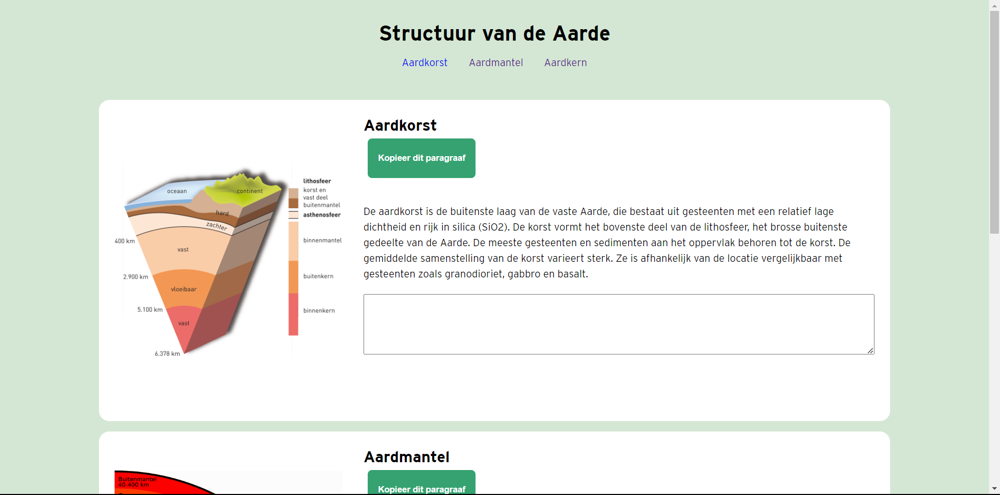

# Human centred Design
Voor het vak human centred design ga ik een ontwerp maken voor een specifieke persoon. Tijden dit vak hou ik de gebruiker centraal. Op basis van testen ga ik mijn prototype itereren totdat het doel is bereikt. 

## User scenario

## Wie is Nicolette Besemer?
Nicolette kan beperkt gebruik maken van haar ledematen.  Nicolette houdt zich veel bezig met toegankelijkheid. Daarnaast organiseerd ze veel voor de buurt en voor andere vrijwilligers. Ze is geoloog van beroep geweest en bezoekt graag natuurkundige wonderen. Ook is ze gepassioneerd door de natuur. Ze gebruikt een rolstoel om zich te verplaatsen, en op haar computer maakt ze gebruik van spraaksoftware en een tekentablet in plaats van een muis. Dit maakt navigeren lastig omdat ze geen snelkoppelingen kan gebruiken.

## Hoe kan het opgelost worden?
Voor haar werk leest en deelt Nicolette veel stukken tekst op o.a. de website van de gemeente. Het is belangrijk om hier de juiste stukken uit te kunnen halen en door te kunnen sturen. Zonder rechtermuisknop of snelkoppeling is knippen en plakken bijna niet mogelijk. Ontwerp een manier om met spraak en tekentablet tekst te navigeren, selecteren, te knippen en te plakken.

## Vragen voor de testen
- Over haar zelf vertellen?
- Wat doe je allemaal op de computer

- Wat kan je allemaal met uw tablet?
- Hoe ervaart ben u met computer bedienen met spraak.
- Wat voor tablet heeft u?
- Welke instellingen heeft u opgesteld op uw tablet?
- Hoe plak en paste uw op de browser?
- Wat zijn jouw beperkingen met de tekentablet, wat wil je nog kunnen doen?
- Waarom gebruikt u tablet eigenlijk?
- Hoe gebruik ze spraak op de web? Wat voor soort software gebruik u?

## Prototype 1 - Knippen en plakken met een button
Ik heb de informatie over Nicolette  gelezen. Ik ken haar nog niet , dus met al  mijn aanames een prototype gemaakt. Mijn prototype is een HTMl pagina van het structuur van de aarde. Ik heb gehoord dat ze geoloog is dus ik heb een artikel gevonden over het structuur van de aarde. Dus de pagina bestaat uit een aantal onderdelen. Per onderdeel kun je up het kopieer button kopieren en in de textarea plakken als je op de button klikt. 

## Test 1
Ik heb mijn eerste test gedaan. Ze zat in een rolstoel en beweegt zich met haar voeten. Verder kan ze haar armen bewegen. Ze gebruik meestal haar tweede vinger om haar mobiel te bedienen. Nicolette gebruikt een wacom intous S tekentablet om haar computer te bedienen en de spraak software dragon 6 om commando's uitvoeren. 

## Study Situation
Haar computer tussen haar hoofd, armen en benen zijn kapot. Dus ze heeft geen contact met haar ledenmaten. Dus ze kan niet voelen. Haar centrale zenuwstelsel is wel goed en alleen de andere zenuwstelsel. Het is voor haar een gedoe om te knippen en plakken. 

### Algemene informatie over Nicolette 
- Is geoloog
- Werkte bij gemeente Amsterdam
- Voorzitter van de gehandicapt organisatie zuidoostwest in 2001

### Soort device die ze gebruikt
- Heeft een acer laptop windows 11
- Ze kan niet typen, ze typt met spraak op haar tablet
- Ze gebruik de tekentablet alleen als een muis. 
  - Ze beweegt wel met de pen heen en weer maar niet zo goed
- Ze gebruik een wacom intuos S tekentablet, ze heeft het al heel lang. 
- heeft laatst een nieuwe laptop
  
### Wat haar passie is:
- Ze gaat naar vakantie met haar nieuwe laptop, tekentablet en microfoon voor de spraak. 
- Omdat ze geoloog is ga ze naar ijsland met vakantie, ze gaat met de helicopter. Ze gaat spitsbergen zien. 
- Ze leest meestal op papier, want ze is ouderwets. Ik denk veel boeken.
- Ze gebruik allerlei soort van websites, vooral architectuur websites, klimaatverandering, biologie, geologie .
- Ze leest ook kranten.
- Onderwerp die haar interesseert zijn, natuur, klimaatverandering, 
- 
  
### Haar beperkingen
- Ze heeft een trage reactie snelheid
- Kan niet drukken en slepen, heeft veel moeite om te scrollen
- Kan haar tweede vingers gebruiken
- Kan niet snel typen, alleen wachtwoorden. Ze typt met spraak. 
- Kan geen shortcuts gebruiken, ze probeer wel
- Kan ook niet zo goed zien.

### Haar moeite met Knippen en Plakken
Omdat ze veel schrijft, heeft ze veel bestanden. Het wordt steeds moeilijker om van de en plek een stuj kopieren en in een andere bestandmap plaatsen...

### Inzichten van het prototype

### Functionaliteiten
- Ervoor zorgen dat je actie kan uitvoeren met één commando, toets, tap, klik(met de tablet);
- Makkelijk bestanden kopieren en plakken in een andere bestandmap. 
- Kopieren zonder langer te scrollen

### Iteratie
- Een simulatie maken hoe ze bestanden kan kopieren en plaatsen naar de ene plek naar een andere plej