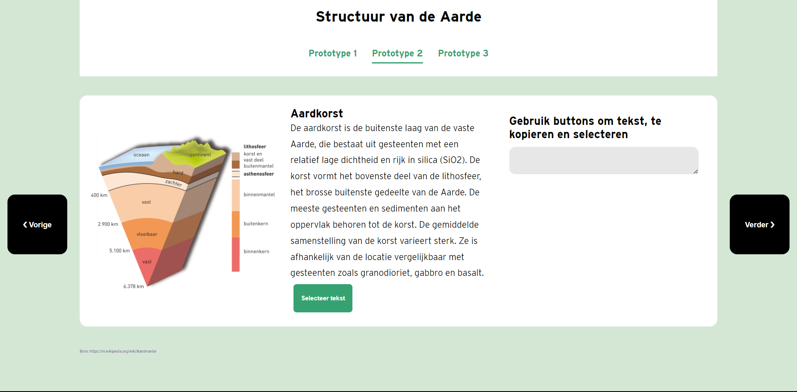
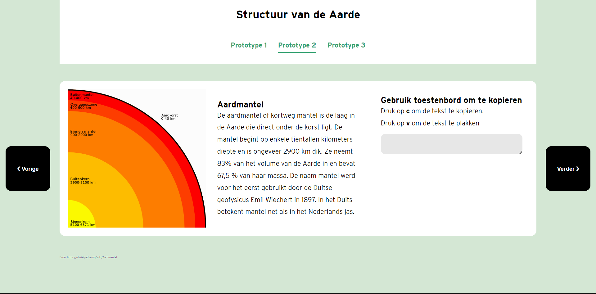

# Human centred Design
Voor het vak human centred design ga ik een ontwerp maken voor een specifieke persoon. Tijden dit vak hou ik de gebruiker centraal. Op basis van testen ga ik mijn prototype itereren totdat het doel is bereikt. 

# Inhoudsopgave 
- [Study Sitution]()
- [User Scenario]()
  - [Wie is Nicolette Besemer]()
  - [Wat is het doel van Nicolette]()
  - [Hoe kan Nicolette haar doel bereiken]()
  - [Waarom gaat Nicolette op Mijn site]()
- [Testen]()
- [Test 1]()
- [Prototype 1]()
  - [Bevindingen van Test 1]()
  - [Inzichten van het prototype]()
  - [Mogelijke Ideen Voor het prototype 2]()
- [Prototype 2]()
- [Test 2]()
  - [Testplan]()
  - [Bevindingen van Test 2]()
  - [Inzichten van het prototype]()
  - [Mogelijke Ideen Voor het prototype 3]()
- [Prototype 3]()
- [Exclusive Design Principes]()
- [Features]()
- [Wishlist]()
---

# Study Situation
## User scenario

## Wie?
## Wie is Nicolette Besemer?
Nicolette is een 76 jarige vrouw. Nicolette kan beperkt gebruiken van haar ledematen. Ze kan deels haar arm en benen gebruiken.Ze gebruikt een rolstoel om zich te verplaatsen. 
Zij is opgeleid als geooloog, en hou echt van onderwerpen over klimaatverandering en het natuur. Door haar passie had ze bij gemeente Amsterdam, waar ze veel activiteiten organiseerde voor gehandicapten.
 
 Nicolette heeft een laptop waar ze veel documenten opslaan. Om haar laptop te bedienen gebruik ze een teken tablet Wacom Intuos S en dragon een spraaksoftware. Haar tekentablet gerbuik ze als een muis waar ze op elementen kan klikken. Want ze heeft meer controle op de pen. Verder gebruik ze de spraaksoftware  als een alternatief voor de toetsenboard. Ze kan wel typen maar niet zo snel, kan een voor een een toets indrukken. Dus Nicolette kan wel op haar eigen manier haar laptop bedienen.

 ## Wat is Het doel van Nicolette?
 Nicolette leest graag veel artikelen. Mijn website heb je een artikel over het structuur van de aarde. Soms wil ze zonder hulp belangrijke stukken van het artikel in een andere documenten te ze zetten. Om het stukje tekst te kunnen te bewaren, wil ze de tekst zelf kunnen kopiëren en ergens plakken met haar tablet, toetsenbord of spraak.  

###  Wat zijn haar beperkingen
- Kan niet slepen met touch of de pen
- Kan typen maar ze drukt een voor een een toets in, dus kan geen shortcuts zoals cnt + v gebruiken
- Heeft heel moeite met scrollen
- Kan niet tekst selecteren met de pen want het indrukken en daarna slepen is moeilijk voor haar. 

Nicolette heeft moeite om ingewikkelde handelingen uit te voeren, handelingen zoals sneltoets, met de pen slepen om te scrollen en tekst te selecteren. 

## Hoe kan Nicolette haar doel bereiken?
Nicolette leest graag artikelen op haar laptop, ze gebruik een wacom tablet als muis en de spraaksoftware als toetsenbord. Tijdens het testen heb ik gezien dat ze kan wel een beetje de muispad en de toetsenbord kan gebruiken. Maar ze heeft wel moeiten om de tekst te selecteren met de pen en de muis. Ze kan geen sneltoetsen gebruiken zoals `ctrl + c ` en `ctrl + v`. Maar ze probeerde het wel. In mijn website verwachte ze dat ze makkelijk stukje tekst kan selecteren, kopiëren en plakken met haar tablet, spraak of toetsenbord. Met andere woorden zou Nicolette makkelijk vinden als ze met één commando, toets, tap of klik(met de tablet) een actie tekst kunnen selecteren, kopiëren en plakken. Dus met zo min mogelijke handeling een directe actie uitvoeren.

## Waarom ga Nicolette op mijn site?
Op mijn site heeft Nicolette de mogelijkheid om tekst kopiëren, selecteren en plakken met een button en de toetsenbord. Ze hoeft ook niet te slepen en scrollen om tekst te selecteren. Wanneer de tekst geselecteerd is hoeft ze door middel van een knop kopiëren en plakken. Dus ze hoeft niet afhankleijk te zijn op de technieken al bestaan. En het gebasseerd op de apparaten die ze al gebruikt. Hiermee heeft ze haar doel bereikt om makkelijk te kopiëren en plakken met haar tablet.

# Testen
## Test 1
Ik heb daardoor op basis van wat ik he gelezen, zonder haar te kennen een eerste versie van het prototype gemaakt. Het eerste test was voraal een kennismaking gesprek, waar ik Nicolette beter leren kennen. Ik heb daarna  mijn prototype laten zien en ze heeft het getest. Ik heb haar gevraagd wat ze ervan vond en wat ze nog zou willen.

## Vragen voor de testen
- Over haar zelf vertellen?
- Wat doe u allemaal op de computer

- Wat kan u allemaal met uw tablet?
- Hoe ervaart ben u met computer bedienen met spraak.
- Wat voor tablet heeft u?
- Welke instellingen heeft u opgesteld op uw tablet?
- Hoe plak en paste uw op de browser?
- Wat zijn jouw beperkingen met de tekentablet, wat wil je nog kunnen doen?
- Waarom gebruikt u tablet eigenlijk?
- Hoe gebruik ze spraak op de web? Wat voor soort software gebruik u?

## Prototype 1 - Knippen en plakken met een button
Ik heb de informatie over Nicolette  gelezen. Ik ken haar nog niet , dus met al  mijn aanames een prototype gemaakt. Mijn prototype is een HTMl pagina van het structuur van de aarde. Ik heb gehoord dat ze geoloog is dus ik heb een artikel gevonden over het structuur van de aarde. Dus de pagina bestaat uit een aantal onderdelen. Per onderdeel kun je up het kopieer button kopiëren en in de textarea plakken als je op de button klikt. 

## Ontwerpkeuze
Ik heb voor mijn webpagina verschillende tinten van groen gebruikt. Over de informatie die ik had gekregen van Nicolette was dat ze een geoloog is en heeft een passie voor het natuur.  Dus ike heb groen gebruikt, omdat ik asocieer dit kleur met natuur. 

Bovenaan heb je een titel die benoemt waarover het artikel gaat en de content is verdeeld in drie onderdelen, die je kan kopiëren en plakken. Ik heb voor een textarea gekozen, omdat je daar makkelijk tekst kan plakken.

## Bevindigen van test 1
De volledige inzichten van de eerste test staat in mijn [Wiki](https://github.com/K3A101/HCD-knippen-en-plakken/wiki/Test-1-met-Nicolette)

## Inzichten van het prototype
Ik heb haar mijn prototype laten proberen. Ik heb eerst vertelt wat ik allemaal heb gedaan. Toen ze ht zag was echt blij. Haar reactie: "Wat leuk!". Ik heb mijn laptop en mijn Wacom tekentablet gebruikt zodat ze kan testen. De teketablet was toevallig eentje die ze kon ook gebruiken. Dus het was makkelijk om de prototype te testen. Ik heb gevraagd hoe ze de tablet gebruikt en ik heb zo voor haar opgesteld. De tablet zet ze aan de rechterkant, want ze gebruikt haar rechterarm. De laptop is aan de linkerkant en naar voren geschoven. 

Ik heb een instructie gegeven hoe ze de prototype gebruikt. Ik heb een scenario opgesteld  en daarna heeft ze aan ons laat zien hoe ze die gebruikt. Ik heb als interactie dat ze met een knop een paragraaf kan kopiëren en daarna in de vakje plakken. 

Inzichten:
 - Ze vond het heel makkelijk want ze hoeft niet alles te selecteren
 - Ze zou wel fijn vinden te selecteren zonder te scrollen
 - Ze heeft op haar pen een rechtermuis knop aan dus ze kan een beetje selecteren, maar het ze wilt het doen met spraak
 - Hoe selecteer ze met spraak?
   - 10 keer scrollen zeggen
 - Instellingen van Spraak makkelijker maken om de tekst te kunnen selecteren.
- Vond het was makkelijk, maar ze vindt het wel een kleuterschool oplossing
- Ze wil niks dat al voor je oplost, en wil wel op een makkelijke manier kunnnen selecteren. 
- Ze is wel blij dat ze de buttons kunnen aanklikken, want ze heeft haar doel van knippen en plakken bereikt, maar het is te makkelijk. Maar ze vind het ook leuk om te doen. 

### Mogelijke ideeen voor prototype 2
- Ervoor zorgen dat je actie kan uitvoeren met één commando, toets, tap, klik(met de tablet);
- Prototype kan over het natuur en geologie gaan
- Makkelijk bestanden kopiëren en plakken in een andere bestandmap. 
- Kopiëren zonder langer te scrollen
- Als ze hovert op de button dan wordt het geselecteerd
- Alle elementen moet in light modus gedaan worden
- Er moet een duidelijk contrast hebben tussen de voorgrond en de achtergrand.
- Tekst moet groot genoeg zijn zodat ze die kan lezen
- Acties moet uitgevoerd worden zonder een combinaties van handelingen shortcuts en gestures.
- Selecteren zonder te slepen
- Met een toets/spraak naar beneden scrollen, of naar de zijkant gaan
- Het minst mogelijk handelingen om stukken te selecteren,
- Makkelijker manier vinden om te selecteren zonder te scrollen 
- De touch target groter maken voor haar vingers, zodat ze de knop makkelijker kan drukken
- Kan een leuke commando verzinnen die een paar handelingen doet. Om te knippen en te plakken.
- Kan de toetsenbord gebruiken als hulpmiddel, gewoon met een toets een actie laten uitvoeren. - Extension maken
- Met alleen een toets een menu zichtbaar maken/ of acties uit voeren
- Haar Spraak software makkelijk aan en uit kan zetten, bij haar vorige laptop kon ze dat doen met de + toets
- Een extensie maken waarvan ze bij artikelen een kopie button komt en ze kan de content kopeieren, en in woord plakken. Ook feedback geven dat ze de teks had gekopieerd.
- 

# Prototype 2
Ik heb na de eerste test een nieuwe iteratie gemaakt aan mijn prototype. Het onderwerp bleef hetzelfde, maar de layout is verandert. 
Nu bestaat de pagina uit een navigatie menu waar de gebruiker kan kiezen uit verschillende prototype. Het is ook voor mij handig want dan kun je het process zien. 

### Iteratie
- Ik heb de prototype in een navigatie menu gezet, zodat ze kan kiezen welke prototype ze wilt testen.
- Om  naar het volgende paragraaf te gaan hoeft ze niet te scrollen, maar ze kan op de knop klikken en dan gaat ze naar de volgende paragraaf.
- Tekst kan geselecteerd worden met een knop, zodat ze niet hoeft ze niet met haar pen te slepen.
- Ze kan tekst kopiëren met de c toets en plakken met de v toets. 
- Er Straat instructies, hoe ze moet kopeieren en plakken.
- De tekst is groot genoeg zodat ze het kan lezen.
- Kopieer en plak knoppen zijn onder het paragraaf

## Test 2
### Testplan
Voor de tweede test heb ik een testplan met aantal taken voor Nicolette. Met deze taken kan ze gewoon meer gericht door mijn prototype heen. 

**1. Ga naar het volgende prototype, hoe doe je dat?**
   
**2. U hebt het korte stukje tekst gelezen en wil graag het paragraaf selecteren, kopiëren en plakken.**

**3. U bent klaar met lezen en wil graag het paragraaf lezen Kunt u naar de volgende paragraaf gaan. Dit artikel bestaat uit drie paragrafen.**

**4. In de volgende paragraaf kun je de tekst kopiëren met toetsenbord. Hoe zou je dit aanpakken?**

### Bevindingen van test 2
De volledige inzichten van de tweede test staat in mijn [Wiki](https://github.com/K3A101/HCD-knippen-en-plakken/wiki/Test-2). Voor de test heb ik een testplan gemaakt. 

 ## Inzichten van het prototype
- Ze vond het heel makkelijk want ze hoeft niet alles te selecteren door te slepen
- Om de tekst te selecteren gaat ze op de pen te drukken en dan probeer ze met de pen te slepen om de tekst te selecteren
- Met spraak kan zeg ze “selecteer aardkorst tot en met basalt”.
- Vind wel handig als je met een knop de tekst kan selecteren en dan met spraak de tekst kopiëren en plakken. 
- Bij de tweede paragraaf waren de instructie niet duidelijk dat ze met de toetsenbord moet tekst kopiëren en plakken.
Heeft as later de instructie gelezen, dus de instructies waren niet duidelijk genoeg voor haar.
Vond de eerste interactie hartstikke mooi. 
- Om naar het volgende paragraaf te gaan dacht ze eerst om naar prototype drie te gaan of de verder knop te klikken. Ze heeft besloten om op verder te klikken. 
- Ze kan wel met de toetsenbord werken, dus ze drukt c en v in en ze kon hiermee met het toetsenbord gekopieerd en geplakt. 
- Ze zag niet eens de feedback dat ze de tekst gekopieerd heeft.

### Mogelijke ideeën voor prototype 
- Een mogelijkheid waar ze op basis van een selectie, de tekst meteen wordt gekopieerd.
- Met arrow toets tekst selecteren
- De feedback bericht duidelijker maken, zodat ze meteen kan zien dat ze de tekst heeft gekopieerd en geplakt.
- 

---
# Exclusive design principes

EXclusive design principes
- Study situation
- Prioritise identity
- Ignore conventions
- Add nonsense

## Study Situation
De study situation pricipe ga je kijken naar de situatie van de test persoon. Je ga bestuderen wat hun beperkingen zijn, welke apparaten gebruiken ze, wat he probleem is. 

Met dit principe heb ik de situatie van Nicolette leren kennen. Het is bereikt door de twee testen die ik had uitgevoerd met haar. Daardom kom ik te weten dat ze niet een goede communicatie heeft tussen haar hersenen met haar ledematen. Ze gebruikt een rolstoel om zich te verplaatsen, maar kan nog steeds haar armen en benen bewegen. Ze gebruikt een spraakprogramma als een toetsenboard, om berichten te versturen, maar ze kan wel toetsen indrukken. Verder gebruik ze een wacom tekentablet met een pen en die als een muis bedienen. De tablet gebruikt ze om haar laptop te gebruiken. Wanneer ze een actie op haar laptop wil doen, gebruik ze zo min mogelijk handelingen om die te bereiken. Verder heeft ze ook aan ons verteld dat ze aan passie heeft aan de natuur, klimaatverandering, politiek en geologie. Ze leest ook veel, vooral de bovengenoemde onderwepen. Op basis van deze informatie heb ik een prototype voor haar gemaakt.

## Prioritise identity
Ik heb haar gevraagd wat haar passie is en wat ze leuk vindt om te doen. Ze vertelde dat ze van natuur en geologie houdt. Dus ik heb een prototype gemaakt over natuur en geologie. Daardoor heb ik een stujke informatie gezocht over structuur van het aarde zodat ze gemak heeft om de paragraaf te kopiëren.

## Ignore conventions
 Als je voor een groot doelgroep iets ontwerp, moet je ontwerppatronnen gebruiken want mensen weten hoe die werken en kunnen ze makkelijk de website gebruiken. Met de ignore conventions, wordt bedoeld dat je prototype gaat maken die buiten de norm gaat Het prototype hoeft niet voor een groot groep mensen passen maar alleen voor het persoon die het prototype voor bedoeld is. 

Om tekst te kopiëren en plakkenmoet je normaal gesproken, cnt + v en cntr + c gebruiken. Maar voor Nicolette heb ik andere manieren gevonden waarvan ze makkelijk tekst kan kopiëren en plakken.
Ik heb ervoor gezorgd dat ze met buttons tekst kan selecteren in plaats van slepen me haar pen. Ook zorgde ik ervoor dat ze met een zo min mogelijk handelingen/ combinaties van toets een actie kan uitvoeren.

Verder heb ik een artikel per stuk verdeeld. Da hoef ze niet te scrollen, maar ze kan op de knop klikken en dan gaat ze naar de volgende paragraaf.
Dit maak het makkelijk vooor haar om een stuk tekst te selecteren en te kopiëren.

## Add nonsense
Met de add nonsense principe ga ik waarde geven voor een specifieke gebruiker. Dus iets toevoegen specifiek voor de persoon die de gebruiker blij maakt.

---
## Features
- [] Met een button tekst kopiëren en plakken
- [] Met spraak commando's uitvoeren.
- [] Met  buttons tekst selecteren.
- [] Met de toetsenbord tekst kopiëren en plakken. 
- [] Met buttons naar het volgende paragraaf 

## Wishlist
- [] een manier vinden waar ze kan zinnen kan selecteren
- [] tekst kopiëren met spraak

---
# Conclusie
