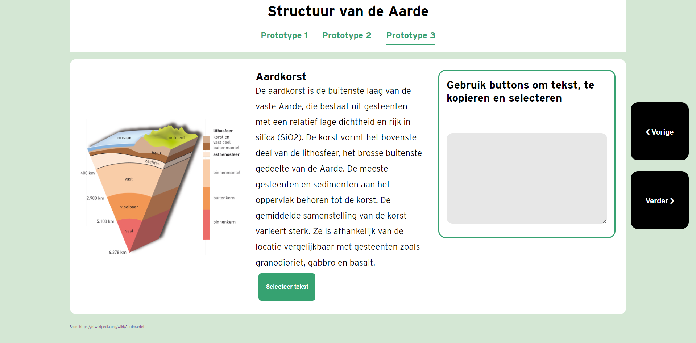
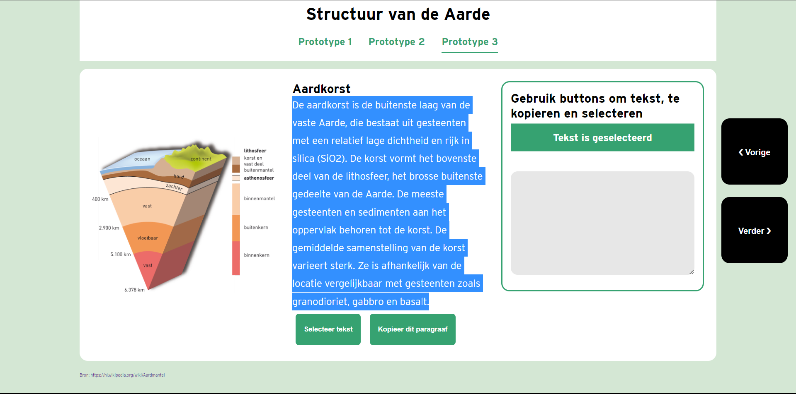
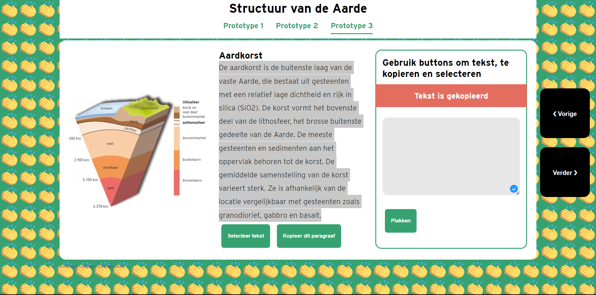
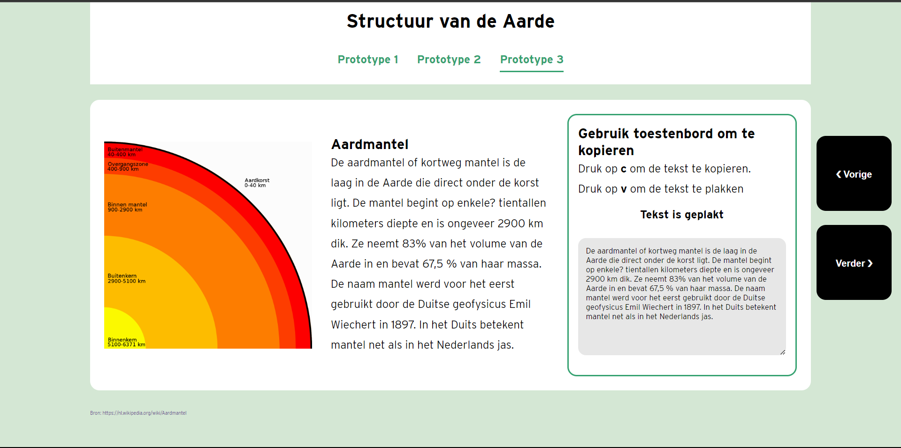

# Knippen en Plakken zonder Klikken

<!--  -->

## Onderzoeksvraag
### Kopiëren en plakken zonder klikken
> Hoe kan Nicolette kopiëren en plakken zonder een muis?

## Probleemdefinitie
Nicolette kan heel beperkt haar armen en benen gebruiken, ze gebruikt geen muis en gebruikt nauwelijks het toetsenbord. Dus ze kan niet snelkoppelingen en de rechtermuis gebruiken. Als alternatief gebruik ze  een wacom tekentablet met een pen als muis en een spraakprogramma als toetsenbord. Omdat Nicolette geen muis of snellkoppeling gebruikt, wordt het moeilijker om tekst te kopiëren en plakken. Aan mij de taak gegegeven om een ontwerp te maken waar ze tekst kan kopiëren zonder snelkoppelingen of de rechtermuisknop.

## Opossing

Als oplossing heb ik een artikel over structuur van de aarde gebruikt. Het artikel is verdeeld in drie pargrafen. Per paragraaf zijn er verschillende manieren om tekst te selecteren zonder een muis. Om tussen de paragrafen te navigeren moet Nicolette op de vorige en volgende knop te drukken, dan hoeft ze niet te scrollen. In het eerste paragraaf kan Nicolette met knoppen het hele paragraaf selecteren, kopiëren en plakken. De knoppen hoeft ze alleen met de pen te klikken. Bij het tweede paragraaf kan ze met de toetsenbord kopiëren, dus als ze `c` indrukt wordt de tekst gekopieerd. En als ze `v` indrukt kan de tekst ergens plakken. 

## Link prototype
- Link: https://k3a101.github.io/HCD-knippen-en-plakken/prototype-v3.html

---
# Human centred Design - Proces documentatie
Voor het vak human centred design ga ik een ontwerp maken voor een specifieke persoon. Tijden dit vak hou ik de gebruiker centraal. Op basis van testen ga ik mijn prototype itereren totdat het doel is bereikt. 

# Inhoudsopgave 
- [Knippen en Plakken zonder Klikken](#knippen-en-plakken-zonder-klikken)
  - [Onderzoeksvraag](#onderzoeksvraag)
    - [Kopiëren en plakken zonder klikken](#kopiëren-en-plakken-zonder-klikken)
  - [Probleemdefinitie](#probleemdefinitie)
  - [Opossing](#opossing)
  - [Link prototype](#link-prototype)
- [Human centred Design - Proces documentatie](#human-centred-design---proces-documentatie)
- [Inhoudsopgave](#inhoudsopgave)
- [Study Situation](#study-situation)
  - [User scenario](#user-scenario)
  - [Wie?](#wie)
  - [Wie is Nicolette Besemer?](#wie-is-nicolette-besemer)
  - [Wat is Het doel van Nicolette?](#wat-is-het-doel-van-nicolette)
    - [Wat zijn haar beperkingen](#wat-zijn-haar-beperkingen)
  - [Hoe kan Nicolette haar doel bereiken?](#hoe-kan-nicolette-haar-doel-bereiken)
  - [Waarom ga Nicolette op mijn site?](#waarom-ga-nicolette-op-mijn-site)
- [Testen](#testen)
  - [Do's and Dont bij testen](#dos-and-dont-bij-testen)
  - [Test 1](#test-1)
  - [Vragen voor de testen](#vragen-voor-de-testen)
  - [Prototype 1 - Knippen en plakken met een button](#prototype-1---knippen-en-plakken-met-een-button)
  - [Ontwerpkeuze](#ontwerpkeuze)
  - [Bevindigen van test 1](#bevindigen-van-test-1)
    - [Observaties](#observaties)
  - [Inzichten van het prototype](#inzichten-van-het-prototype)
    - [Mogelijke ideeën voor prototype 2](#mogelijke-ideeën-voor-prototype-2)
  - [Conclusie](#conclusie)
- [Prototype 2](#prototype-2)
    - [Iteratie](#iteratie)
    - [Ontwerpkeuze](#ontwerpkeuze-1)
  - [Test 2](#test-2)
    - [Testplan](#testplan)
    - [Bevindingen van test 2](#bevindingen-van-test-2)
  - [Observaties](#observaties-1)
  - [Inzichten van het prototype](#inzichten-van-het-prototype-1)
    - [Mogelijke ideeën voor prototype 3](#mogelijke-ideeën-voor-prototype-3)
  - [Conclusie](#conclusie-1)
  - [Prototype 3](#prototype-3)
    - [Kopiëren en plakken met knoppen](#kopiëren-en-plakken-met-knoppen)
    - [Feedback dat de tekst is geselecteerd](#feedback-dat-de-tekst-is-geselecteerd)
    - [Gefeliciteerd bericht dat ze de tekst heeft gekopieerd](#gefeliciteerd-bericht-dat-ze-de-tekst-heeft-gekopieerd)
    - [Tekst kopiëren met de toetsenbord](#tekst-kopiëren-met-de-toetsenbord)
    - [Iteratie](#iteratie-1)
- [Exclusive design principes](#exclusive-design-principes)
  - [Study Situation](#study-situation-1)
  - [Prioritise identity](#prioritise-identity)
  - [Ignore conventions](#ignore-conventions)
  - [Add nonsense](#add-nonsense)
  - [Features](#features)
  - [Wishlist](#wishlist)
- [Conclusie](#conclusie-2)
  - [Reflectie](#reflectie)
---

# Study Situation
## User scenario

## Wie?
## Wie is Nicolette Besemer?
Nicolette is een 76 jarige vrouw. Nicolette kan beperkt gebruiken van haar ledematen. Ze kan deels haar arm en benen gebruiken.Ze gebruikt een rolstoel om zich te verplaatsen. 
Zij is opgeleid als geooloog, en hou echt van onderwerpen over klimaatverandering en het natuur. Door haar passie had ze bij gemeente Amsterdam, waar ze veel activiteiten organiseerde voor gehandicapten.
 
 Nicolette heeft een laptop waar ze veel documenten opslaan. Om haar laptop te bedienen gebruik ze een teken tablet Wacom Intuos S en dragon een spraaksoftware. Haar tekentablet gerbuik ze als een muis waar ze op elementen kan klikken. Want ze heeft meer controle op de pen. Verder gebruik ze de spraaksoftware  als een alternatief voor de toetsenboard. Ze kan wel typen maar niet zo snel, kan een voor een een toets indrukken. Dus Nicolette kan wel op haar eigen manier haar laptop bedienen.

 ## Wat is Het doel van Nicolette?
 Nicolette leest graag veel artikelen.Op mijn website heb je een artikel over het structuur van de aarde, haar favoriete onderwerp. Soms wil ze zonder hulp belangrijke stukken tekst van het artikel in een andere documenten te ze zetten. Om het stukje tekst te kunnen  bewaren, wil ze de tekst zelf kunnen kopiëren en ergens plakken met haar tablet, toetsenbord of spraak.  

###  Wat zijn haar beperkingen
- Kan niet slepen met touch of de pen
- Kan typen maar ze drukt één voor één  een toets in, dus ze kan geen snelkoppeling zoals cnt + v gebruiken
- Heeft heel moeite met scrollen
- Kan niet tekst selecteren met de pen want het indrukken en daarna slepen is moeilijk voor haar. 

Nicolette heeft moeite om ingewikkelde handelingen uit te voeren, handelingen zoals sneltoets, met de pen slepen om te scrollen en tekst te selecteren. 

## Hoe kan Nicolette haar doel bereiken?
Nicolette leest graag artikelen op haar laptop, ze gebruik een wacom tablet als muis en de spraaksoftware als toetsenbord. Tijdens het testen heb ik gezien dat ze  wel een beetje   de muispad  kan bheren en de toetsenbord  gebruiken. Maar ze heeft wel moeite om de tekst te selecteren met de pen en de muis. Ze kan geen sneltoetsen gebruiken zoals `ctrl + c ` en `ctrl + v`. Maar ze probeerde het wel. In mijn website verwachte ze dat ze makkelijk stukje tekst kan selecteren, kopiëren en plakken met haar tablet, spraak of toetsenbord. Met andere woorden zou Nicolette makkelijk vinden als ze met één commando, toets, tap of klik(met de tablet) een actie tekst kunnen selecteren, kopiëren en plakken. Dus met zo min mogelijke handeling een directe actie uitvoeren.

## Waarom ga Nicolette op mijn site?
Op mijn site heeft Nicolette de mogelijkheid om tekst kopiëren, selecteren en plakken met een button en de toetsenbord. Ze hoeft ook niet te slepen en scrollen om tekst te selecteren. Wanneer de tekst geselecteerd is hoeft ze door middel van een knop kopiëren en plakken. Dus ze hoeft niet afhankleijk te zijn op de technieken die al bestaan. En het is gebasseerd op de apparaten die ze al gebruikt. Hiermee heeft ze haar doel bereikt om makkelijk zonder hulp te kopiëren en plakken met haar tablet.

# Testen

## Do's and Dont bij testen
Tijdens het testen heb ik bepaalde dingen gedaan en niet gedaan. Hieronder staan de dingen die ik heb gedaan en niet gedaan.
- Geen suggesties geven
- Geen oplossingen geven
- De testpersoon aanmoeden om hardop te denken
- De vragen van de testpersoon beantwoorden met een wedervraag
- De testpersoon niet helpen
- De testpersoon niet sturen

## Test 1
Ik heb daardoor op basis van wat ik he gelezen, zonder haar te kennen een eerste versie van het prototype gemaakt. Het eerste test was voraal een kennismaking gesprek, waar ik Nicolette beter leren kennen. Ik heb daarna  mijn prototype laten zien en ze heeft het getest. Ik heb haar gevraagd wat ze ervan vond en wat ze nog zou willen.

## Vragen voor de testen
- Over haar zelf vertellen?
- Wat doe u allemaal op de computer

- Wat kan u allemaal met uw tablet?
- Hoe ervaart ben u met computer bedienen met spraak.
- Wat voor tablet heeft u?
- Welke instellingen heeft u opgesteld op uw tablet?
- Hoe plak en paste uw op de browser?
- Wat zijn jouw beperkingen met de tekentablet, wat wil je nog kunnen doen?
- Waarom gebruikt u tablet eigenlijk?
- Hoe gebruik ze spraak op de web? Wat voor soort software gebruik u?

## Prototype 1 - Knippen en plakken met een button
Ik heb de informatie over Nicolette  gelezen. Ik ken haar nog niet , dus met al  mijn aanames een prototype gemaakt. Mijn prototype is een HTMl pagina van het structuur van de aarde. Ik heb gehoord dat ze geoloog is dus ik heb een artikel gevonden over het structuur van de aarde. Dus de pagina bestaat uit een aantal onderdelen. Per paragraaf kun je up het kopieer button kopiëren en in de textarea plakken als je op de button klikt. 

## Ontwerpkeuze
Ik heb voor mijn webpagina verschillende tinten van groen gebruikt. Over de informatie die ik had gekregen van Nicolette was dat ze een geoloog is en heeft een passie voor het natuur.  Dus ike heb groen gebruikt, omdat ik asocieer dit kleur met natuur. 

Bovenaan heb je een titel die benoemt waarover het artikel gaat en de content is verdeeld in drie onderdelen, die je kan kopiëren en plakken. Ik heb voor een textarea gekozen, omdat je daar makkelijk tekst kan plakken.

## Bevindigen van test 1
De volledige inzichten van de eerste test staat in mijn [Wiki](https://github.com/K3A101/HCD-knippen-en-plakken/wiki/Test-1-met-Nicolette)

### Observaties
- Gebruik eew wacom tablet intous S met een stylus
- Gebruik de pen als een muis
- Kan wel de toetsenbord gebruiken maar kan niet snel typen
- Ze zet de tablet aan de rechterkant van haar laptop

## Inzichten van het prototype
Ik heb haar mijn prototype laten proberen. Ik heb eerst vertelt wat ik allemaal heb gedaan. Toen ze ht zag was echt blij. Haar reactie: "Wat leuk!". Ik heb mijn laptop en mijn Wacom tekentablet gebruikt zodat ze kan testen. De teketablet was toevallig eentje die ze kon ook gebruiken. Dus het was makkelijk om de prototype te testen. Ik heb gevraagd hoe ze de tablet gebruikt en ik heb zo voor haar opgesteld. De tablet zet ze aan de rechterkant, want ze gebruikt haar rechterarm. De laptop is aan de linkerkant en naar voren geschoven. 

Ik heb een instructie gegeven hoe ze de prototype gebruikt. Ik heb een scenario opgesteld  en daarna heeft ze aan ons laat zien hoe ze die gebruikt. Ik heb als interactie dat ze met een knop een paragraaf kan kopiëren en daarna in de vakje plakken. 

Inzichten:
 - Ze vond de interacties heel erg makkelijk want ze hoeft niet alles te selecteren
 - Ze zou wel fijn vinden te selecteren zonder te scrollen
 - Ze heeft op haar pen een rechtermuis knop aan dus ze kan een beetje selecteren, maar het ze wilt het doen met spraak
 - Hoe selecteer ze met spraak?
   - 10 keer scrollen zeggen
 - Instellingen van Spraak makkelijker maken om de tekst te kunnen selecteren.
- Ze wil niks dat al voor je oplost, en wil wel op een makkelijke manier kunnnen selecteren. 
- Ze is wel blij dat ze de buttons kunnen aanklikken, want ze heeft haar doel van knippen en plakken bereikt, maar het is te makkelijk. Maar ze vind het ook leuk om te doen. 
- Ze zet haar tablet aan de rechterkant van haar laptop

### Mogelijke ideeën voor prototype 2
- Ervoor zorgen dat je actie kan uitvoeren met één commando, toets, tap, klik(met de tablet);
- Prototype kan over het natuur en geologie gaan
- Makkelijk bestanden kopiëren en plakken in een andere bestandmap. 
- Kopiëren zonder langer te scrollen
- Als ze hovert op de button dan wordt het geselecteerd
- Alle elementen moet in light modus gedaan worden
- Er moet een duidelijk contrast hebben tussen de voorgrond en de achtergrand.
- Tekst moet groot genoeg zijn zodat ze die kan lezen
- Acties moet uitgevoerd worden zonder een combinaties van handelingen shortcuts en gestures.
- Selecteren zonder te slepen
- Met een toets/spraak naar beneden scrollen, of naar de zijkant gaan
- Het minst mogelijk handelingen om stukken te selecteren, bijvoorbeeld toets, spraak commando's en knoppen.
- Makkelijker manier vinden om te selecteren zonder te scrollen 
- De touch target groter maken voor haar vingers, zodat ze de knop makkelijker kan drukken
- Kan een leuke commando verzinnen die een paar handelingen doet. Om te knippen en te plakken.
- Kan de toetsenbord gebruiken als hulpmiddel, gewoon met een toets een actie laten uitvoeren. 
- Met alleen een toets een menu zichtbaar maken/ of acties uit voeren
- Haar Spraak software makkelijk aan en uit kan zetten, bij haar vorige laptop kon ze dat doen met de + toets
- Een oplossing bedenken waarvan ze bij artikelen een kopie button komt en ze kan de content kopeieren, en in woord plakken. Ook feedback geven dat ze de teks had gekopieerd.
  

## Conclusie
In het algemeen kon ze haar doel bereiken, om de tekst te kopiëren en plakken met alleen haar tablet. Ze vind wel dat de interactie meer complex mag zijn. Ze wil niet dat de interactie te makkelijk zijn.

---
# Prototype 2

Ik heb na de eerste test een nieuwe iteratie gemaakt aan mijn prototype.
 Het onderwerp bleef hetzelfde, maar de layout is verandert.Nu bestaat de pagina uit een navigatie menu waar de gebruiker kan kiezen uit verschillende prototype. Het is ook voor mij handig want dan kun je het process zien.  Per paragraaf heb je een andere type interactie. De eerste paragraaf kan ze met buttons tekst selecteren, daarna wordt de kopieer button zichtbaar. Daarna wordt de plakt knop zichtbaar. 
 Bij de tweede paragraaf kan ze met de toets `c` het hele paragraaf kopiëren en `v` plakken. 
 
 Terwijl ze de handelingen uitvoert it  krijgt ze een melding dat ze de tekst had gekopieerd. 

### Iteratie
- Ik heb de prototype in een navigatie menu gezet, zodat ze kan kiezen welke prototype ze wilt testen.
- Om  naar het volgende paragraaf te gaan hoeft ze niet te scrollen, maar ze kan op de knop klikken en dan gaat ze naar de volgende paragraaf.
- Tekst kan geselecteerd worden met een knop, zodat ze niet hoeft ze niet met haar pen te slepen.
- Ze kan tekst kopiëren met de c toets en plakken met de v toets. 
- Er Straat instructies, hoe ze moet kopeieren en plakken.
- De tekst is groot genoeg zodat ze het kan lezen.
- Kopieer en plak knoppen zijn onder het paragraaf.

### Ontwerpkeuze

Omdat de interactie om te kopiëren en plakken niet gebruikt maakt van snekkoppeling of rechtermuis menu. Heb ik aan de rechterkant van de gebruiksaanwijzingen toegevoegd zodat ze precies weet hoe ze moet kopiëren en plakken. 

## Test 2
### Testplan
Voor de tweede test heb ik een testplan met aantal taken voor Nicolette. Met deze taken kan ze gewoon meer gericht door mijn prototype heen. 

**1. Ga naar het volgende prototype, hoe doe je dat?**
   
**2. U hebt het korte stukje tekst gelezen en wil graag het paragraaf selecteren, kopiëren en plakken.**

**3. U bent klaar met lezen en wil graag het paragraaf lezen Kunt u naar de volgende paragraaf gaan. Dit artikel bestaat uit drie paragrafen.**

**4. In de volgende paragraaf kun je de tekst kopiëren met toetsenbord. Hoe zou je dit aanpakken?**

### Bevindingen van test 2
De volledige inzichten van de tweede test staat in mijn [Wiki](https://github.com/K3A101/HCD-knippen-en-plakken/wiki/Test-2). Voor de test heb ik een testplan gemaakt. 

## Observaties
- Voordat ze op de toetsenbord klikt ga ze eerst zoeken waar ze haar vinger moets plaatsen. Ze noemt dat mikken. 
- Ze kan niet in een keer vloeiend van beneden naar boven slepen. Ze doet aantal poging om de cursor naar boven te bewegen. 
- Ze drukt echt hard met de pen op knoppen, ze wil zeker zijn dat ze de button geklikt is met de pen.

 ## Inzichten van het prototype
- Ze vond het heel makkelijk want ze hoeft niet alles te selecteren door te slepen
- Om de tekst te selecteren gaat ze op de pen te drukken en dan probeer ze met de pen te slepen om de tekst te selecteren
- Met spraak kan  ze “selecteer aardkorst tot en met basalt”.
- Vindt wel handig als je met een knop de tekst kan selecteren en dan met spraak de tekst kopiëren en plakken. 
- Bij de tweede paragraaf waren de gebruiksaanwijzing niet duidelijk genoeg. Dus Nicolette wist niet meteen dat ze met de toetsenbord tekst  kan kopiëren en plakken.
- Om naar het volgende paragraaf te gaan dacht ze eerst om naar prototype drie te gaan of de verder knop te klikken. Ze heeft besloten om op verder te klikken. 
- Ze kan wel met de toetsenbord werken, dus ze drukt c en v in en ze kon hiermee met het toetsenbord gekopieerd en geplakt. 
- Ze zag niet eens de feedback dat ze de tekst gekopieerd heeft.

### Mogelijke ideeën voor prototype 3
- Een mogelijkheid waar ze op basis van een selectie, de tekst meteen wordt gekopieerd.
- Met pijl toetsen tekst selecteren.
- De feedback bericht duidelijker maken, zodat ze meteen kan zien dat ze de tekst heeft gekopieerd en geplakt.
- Een bericht geven dat de gebruiker de juiste toets invoert
- Duidelijke gebruiksaanwijzing geven, hoe ze kan kopiëren en plakken.
- Als de gebruiker niet op de juiste toets drukt wordt hij aangeraden op de juiste toetsen te gebruiken
- Belangrijke elementen aan de rechterkant zetten, zodat het makkelijk, door haar te bereiken

## Conclusie
In deze prototype kan Nicolette tekst selecteren met een button. En ze kan ook kopiëren als op de c toets indrukt, en plakken als ze v indrukt. Verder kan ze van de ene paragraaf en naar de andere paragraaf kan gaan met behulp van knoppen.

---
## Prototype 3
Ik heb een kleine iteratie gedaan bij het laatste prototype op basis van de uitvinding van de tweede test. De layout pagina is weer aangepast, de vorige en de volgende button zijn aan de rechterkant geplaatst zodat ze niet veel moet bewegen met de pen. Verder zijn de geruiksaanwijzing wat duidelijker gemaakt, zodat ze precies weet hoe ze de tekst kan kopiëren en plakken. Als laaste heb ik microinteractie toegevoegd bij de knoppen en de feedback zodat ik haar aandacht trekt.

### Kopiëren en plakken met knoppen

### Feedback dat de tekst is geselecteerd

### Gefeliciteerd bericht dat ze de tekst heeft gekopieerd

### Tekst kopiëren met de toetsenbord

### Iteratie
- Duidelijke vormgeving bij de feedback berichten.
- Bewegende buttons om aandacht te trekken.
- Een compliment wanneer ze de tekst kopieert en plakt.
- De vorige en volgende knoppen zijn aan de rechterkant gepositioneerd. 
- De gebruiksaanwijzingen zijn opvallender vormgegeven.

---
# Exclusive design principes

EXclusive design principes
- Study situation
- Prioritise identity
- Ignore conventions
- Add nonsense

## Study Situation
De study situation pricipe ga je kijken naar de situatie van de test persoon. Je ga bestuderen wat hun beperkingen zijn, welke apparaten gebruiken ze en wat het probleem is. 

Met dit principe heb ik de situatie van Nicolette leren kennen. Dit design principe is bereikt door de twee testen die ik had uitgevoerd met haar. Hierdoor wist ik dat ze niet een goede communicatie heeft tussen haar hersenen en haar ledematen. Ze gebruikt een rolstoel om zich te verplaatsen, maar kan nog steeds haar armen en benen bewegen. Ze gebruikt een spraakprogramma als een toetsenboard, om berichten te versturen, maar ze kan wel toetsen indrukken. Verder gebruik ze een wacom tekentablet met een pen en die als een muis bedienen. De tablet gebruikt ze om haar laptop te gebruiken. Wanneer ze een actie op haar laptop wil doen, gebruik ze zo min mogelijk handelingen om die te bereiken. Verder heeft ze ook aan ons verteld dat ze aan passie heeft aan de natuur, klimaatverandering, politiek en geologie. Ze leest ook veel, vooral de bovengenoemde onderwepen. Op basis van deze informatie heb ik een prototype voor haar gemaakt.

## Prioritise identity
Prioritise identity principe gaat over de identiteit van de test persoon. Je gaat kijken wat de passie van de test persoon is, wat hij leuk vindt om te doen. Op basis van hun eigenschappen en identiteit ga je een prototype maken.
Ik heb haar gevraagd wat haar passie is en wat ze leuk vindt om te doen. Ze vertelde dat ze van natuur en geologie houdt. Dus ik heb een prototype gemaakt over natuur en geologie. Daardoor heb ik een stujke informatie gezocht over structuur van het aarde zodat ze gemak heeft om de paragraaf te kopiëren. 

## Ignore conventions
 Als je voor een groot doelgroep iets ontwerp, moet je ontwerppatronnen gebruiken want mensen weten hoe die werken en kunnen ze makkelijk de website gebruiken. Met de ignore conventions, wordt bedoeld dat je prototype gaat maken die buiten de norm gaat Het prototype hoeft niet voor een groot groep mensen passen maar alleen voor het persoon die het prototype voor bedoeld is. 

Om tekst te kopiëren en plakkenmoet je normaal gesproken, cnt + v en cntr + c gebruiken. Maar voor Nicolette heb ik andere manieren gevonden waarvan ze makkelijk tekst kan kopiëren en plakken.
Ik heb ervoor gezorgd dat ze met buttons tekst kan selecteren in plaats van slepen me haar pen. Ook zorgde ik ervoor dat ze met een zo min mogelijk handelingen/ combinaties van toets een actie kan uitvoeren.

Verder heb ik een artikel per stuk verdeeld. Da hoef ze niet te scrollen, maar ze kan op de knop klikken en dan gaat ze naar de volgende paragraaf. Ik heb de knoppen op de rechterkant geplaatst, wat eigenlijk buiten de  norm is. Want Nicolette ze haar tekentablet aan de rechterkant van haar laptop, dus door de knoppen aan rechterkant te plaatsen hoeft ze niet veel slepen. 

## Add nonsense
Met de add nonsense principe ga ik waarde geven voor een specifieke gebruiker. Het betekent niet dat je echt nutteloos dingen moet in het prototype toevoegen. Maar het moet wel passen bij het speciefeke persoon waarvoor je ontwerpt, dat misschien waardeloos zou zijn voor andere mensen. Ik heb ook dit principe toegepast bij prototype 3. Dus wanneer Nicolette de interactie uitvoert om te kopiëren en daarna plakken, verandert de achtergrond naar een patroon klappende handen. Het is een bevestiging of een viering dat ze haar doel had bereikt, wat  ze uiteindelijk wilde. 

---
## Features
- [x] Met een button tekst kopiëren en plakken
- [ ] Met spraak commando's uitvoeren.
- [x] Met  buttons tekst selecteren.
- [x] Met de toetsenbord tekst kopiëren en plakken. 
- [x] Met buttons naar het volgende paragraaf 

## Wishlist
- [ ] een manier vinden waar ze kan zinnen kan selecteren
- [ ] tekst kopiëren met spraak

---
# Conclusie
Hoe kan Nicolette kopiëren en plakken zonder te klikken?
Nicolette zei aan ons dat ze moeite had om tekst te kopiëren en plakken zonder een muis. Dus in de laatste drie weken heb ik een prototype gemaakt waarvan Nicolette makkelijk tekst kopiëren en plakken met haar tekentablet en de toetsenbord. 

Elke keer heb ik mijn prototype met haar laten testen om te kijken hoe ze met de nieuwe interactie kan omgaan. Een opvallende opmerking uit de test blijkt dat Nicolette het scrollen en slepen heel vervelend vond dus dat maakt het moeilijk voor haar om tekst te selecteren, dus dat is ook iets dat het moeilijker maakt om tekst te selecteren en te kopiëren. Na elk user test, had ik bevindingen verzameld. Met de nieuwe bevinding had ik twee versie van mijn prototype gemaakyt.

In mijn laatste prototype kan ze nu met behulp van knoppen tekst kopiëren en plakken, verder is het mogelijk op de toetsenbord met c en v. Dus uiteindelijk heeft Nicolette de mogelijkheid om tekst te selecteren, kopiëren en plakken met behulp van haar tekentablet.

## Reflectie

Het was voor mij ook heel belangrijke om te leren hoe je een prototype maakt voor één gebruiker.
Ik heb veel geleerd de laatste drie weken. Ik heb geleerd om een prototype te maken voor één specifieke persoon. Toen ik de eerste versie van mijn prototypr had gemaakt, had ik veel aannames van Nicolette. Maar na de eerste gebruiker test, kon ik had beter leren kennen en het probleem die Nicolette had met het kopiëren en plakken beter definiëren. Hiermee kon ik haar user needs beter begrijpen en aan de hand daarvan een prototype kunnen maken. Zo heb ik na elke test drie iteratie gemaakt op mijn prototype met elke keer nieuwe interactie om tekst te kopiëren en plakken.